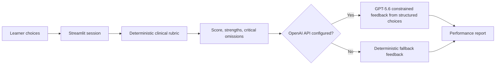

# VascuCase AI

**VascuCase AI** is an adaptive vascular-surgery case simulator built for OpenAI Build Week. The MVP presents a progressive fictional acute lower-limb ischaemia case, scores critical actions with a transparent expert-authored rubric, and uses GPT-5.6 to produce individualized formative feedback when an OpenAI API key is configured.
VascuCase AI uses a deterministic expert-authored scoring rubric and privacy-preserving offline feedback. GPT-5.6 within Codex was used to design, implement, test, debug, and harden the application. Optional API-enhanced feedback is supported by the codebase but is not enabled in the public deployment.

> **Education only.** This application is not a medical device, does not provide patient-specific advice, and must not be used for diagnosis or treatment.

## Why this design

Medical generative AI can explain reasoning fluently, but a language model should not independently define the clinical gold standard. VascuCase AI therefore uses a hybrid architecture:

1. **Deterministic scoring** for diagnosis, Rutherford classification, anticoagulation, escalation, imaging timing, revascularization urgency, and surveillance.
2. **GPT-5.6 feedback** constrained to structured choices, the validated score, and the expert pathway. Optional learner free text is never sent to the model.
3. **Offline fallback** so judges can run the complete case without an API key.

## Features

- Progressive four-stage vascular emergency simulation
- Learner-level selection
- Rutherford acute limb ischaemia classification
- Transparent 100-point rubric
- Critical-omission and unsafe-choice detection
- Optional GPT-5.6 personalized feedback through the OpenAI Responses API
- Required-choice validation and reliable restart behavior at every stage
- Downloadable JSON performance report
- Evidence-base and safety statements embedded in the app
- Automated scoring, state-flow, feedback-boundary, and report tests

## Architecture



The model call uses low reasoning effort, disables response storage, excludes learner free text, and cannot write to the deterministic result or expert pathway. The JSON report is built separately from a snapshot of application state.

## Run locally

### 1. Create an environment

Python 3.11 is recommended because it matches the validated development and deployment target.

```bash
python -m venv .venv
```

Activate it:

```bash
# Windows PowerShell
.venv\Scripts\Activate.ps1

# macOS/Linux
source .venv/bin/activate
```

### 2. Install dependencies

```bash
pip install -r requirements.txt
```

### 3. Optional GPT-5.6 configuration

The app works without an API key. For personalized model feedback:

```bash
# macOS/Linux
export OPENAI_API_KEY="your_key"
export OPENAI_MODEL="gpt-5.6"

# Windows PowerShell
$env:OPENAI_API_KEY="your_key"
$env:OPENAI_MODEL="gpt-5.6"
```

### 4. Launch

```bash
streamlit run app.py
```

Open the local address displayed by Streamlit, usually `http://localhost:8501`.

## Run tests

```bash
pytest -q
```

## Deploy on Streamlit Community Cloud

1. Push this repository to GitHub.
2. In Streamlit Community Cloud, create an app from the repository.
3. Select `app.py` as the entry point.
4. In **Advanced settings**, select Python 3.11.
5. If GPT-5.6 feedback is required, add these values in the Community Cloud **Secrets** field:

   ```toml
   OPENAI_API_KEY = "replace_with_your_key"
   OPENAI_MODEL = "gpt-5.6"
   ```

6. Confirm the complete case, restart button, and JSON download work in a private browser window.

The app is fully usable without secrets. Never commit an API key or `.streamlit/secrets.toml`; that file is already ignored by Git.

## Build Week evidence

The official submission requires a project built with Codex and GPT-5.6, a repository, a public YouTube demo under three minutes, and the `/feedback` Codex Session ID from the primary build thread. Continue development in Codex, preserve the session ID, and make meaningful timestamped commits during the submission period.

Suggested Codex tasks:

- Review the project architecture and run the tests.
- Improve accessibility and responsive design.
- Add a second, clearly fictional vascular case using the existing schema.
- Add test coverage for every unsafe option.
- Prepare deployment and verify the public URL.

## Clinical evidence base

1. Björck M, Earnshaw JJ, Acosta S, et al. European Society for Vascular Surgery (ESVS) 2020 Clinical Practice Guidelines on the Management of Acute Limb Ischaemia. *Eur J Vasc Endovasc Surg.* 2020;59(2):173-218. doi: [10.1016/j.ejvs.2019.09.006](https://doi.org/10.1016/j.ejvs.2019.09.006). PMID: 31899099.
2. Mazzolai L, Teixido-Tura G, Lanzi S, et al. 2024 ESC Guidelines for the management of peripheral arterial and aortic diseases. *Eur Heart J.* 2024;45(36):3538-3700. doi: [10.1093/eurheartj/ehae179](https://doi.org/10.1093/eurheartj/ehae179). PMID: 39210722.

## Limitations

- Single fictional case in the MVP
- Simplified educational rubric rather than a validated assessment instrument
- No learner accounts, longitudinal analytics, or educator dashboard
- GPT feedback quality depends on model availability and configuration
- Clinical content requires local expert and curricular review before institutional adoption

## License

MIT License. Clinical guideline content remains the property of its respective publishers; this project contains original summaries and links, not reproduced guideline tables.
