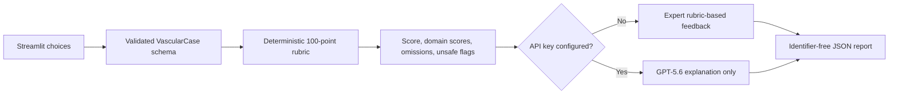

# VascuCase AI

**VascuCase AI** is an eight-case vascular-surgery simulator built for OpenAI Build Week. Learners make four progressive decisions in each fictional case, receive a transparent deterministic score, and get case-specific educational feedback that works without an API key. When configured, GPT-5.6 can enhance the explanation but cannot change the score, unsafe flags, expert pathway, or final diagnosis.

The public pathway uses privacy-preserving offline feedback by default. Optional API-enhanced feedback is supported by the codebase and is enabled only when the deployment owner configures a secret outside source control.

> **Education only.** This application is not a medical device, does not provide patient-specific advice, and must not be used for diagnosis or treatment.

## Case library

| Case | Category | Difficulty |
|---|---|---|
| AF-related embolic acute lower-limb ischaemia, Rutherford IIb | Arterial emergencies | Intermediate |
| Chronic limb-threatening ischaemia with diabetic toe gangrene and infection | Limb salvage | Advanced |
| Severe symptomatic internal carotid stenosis after TIA | Cerebrovascular disease | Intermediate |
| Ruptured infrarenal abdominal aortic aneurysm | Aortic emergencies | Advanced |
| Thrombosed popliteal artery aneurysm with acute limb ischaemia | Arterial emergencies | Advanced |
| Iliofemoral DVT with phlegmasia cerulea dolens | Venous emergencies | Advanced |
| Penetrating common femoral artery injury with hard signs | Vascular trauma | Advanced |
| Acute embolic mesenteric ischaemia | Visceral vascular emergencies | Advanced |

The landing page supports random selection, category-filtered random selection, or a specific case. Random mode avoids an immediate repeat, tracks completed case IDs in session state, and resets the eligible history after all eligible cases have been completed. Case titles are non-diagnostic; the final diagnosis is revealed only after submission.

## Safety-first architecture



- `vascucase/cases/schema.py` defines the Pydantic models and validates four stages, option references, a 100-point rubric, references, learning points, and synthetic/identifier-free metadata.
- `vascucase/cases/library.py` contains the eight fictional cases, stable option IDs, rubrics, expert pathways, and selection/history logic.
- `vascucase/scoring.py` is the sole scoring authority and applies consistent bands: Excellent (90–100), Good (75–89), Developing (60–74), and Needs improvement (below 60).
- `vascucase/feedback.py` builds offline case-specific feedback. Its isolated Responses API path receives rubric-controlled data only and returns prose only.
- `vascucase/reporting.py` exports case metadata and scoring results without answers, identifiers, or unrestricted free text.
- `app.py` owns presentation and recoverable Streamlit session state; it contains no clinical rubric.

## Features

- Eight progressive four-stage vascular scenarios
- Learner-level, random, category, and specific-case selection
- Pydantic-validated cases and explicit 100-point rubrics
- Deterministic domain scores, critical omissions, and unsafe-choice flags
- Expert-authored offline feedback for the public application
- Optional GPT-5.6 explanation through the OpenAI Responses API
- Case history, no immediate random repeat, restart, and new-case workflows
- Diagnosis concealment until submission
- Identifier-free downloadable JSON reports
- Keyboard focus visibility, reduced-motion support, mobile layout rules, and required-answer validation
- Parametrized schema, selection, safety, scoring, reporting, feedback, and Streamlit flow tests

## Run locally

Python 3.11 is the validated runtime.

```bash
python -m venv .venv
```

Activate the environment and install the pinned dependencies:

```bash
# Windows PowerShell
.venv\Scripts\Activate.ps1
pip install -r requirements.txt

# macOS/Linux
source .venv/bin/activate
pip install -r requirements.txt
```

Launch and test:

```bash
streamlit run app.py
pytest -q
```

## Optional GPT-5.6 configuration

No secret is required for the complete public workflow. To enable AI-enhanced explanation, configure environment variables or Streamlit secrets outside source control:

```bash
OPENAI_API_KEY="your_key"
OPENAI_MODEL="gpt-5.6"
```

The Responses API request uses low reasoning effort, low verbosity, disabled response storage, an anonymous safety identifier, and a bounded timeout. API absence, failure, or an empty response uses the expert rubric-based pathway and is never labeled AI-enhanced.

## Streamlit Community Cloud

1. Push the repository to GitHub.
2. Create a Community Cloud app with `app.py` as the entry point and Python 3.11.
3. Deploy without secrets for the public offline pathway.
4. If AI enhancement is desired, add `OPENAI_API_KEY` and `OPENAI_MODEL` in the Cloud secrets UI only.
5. Verify random/category/specific selection, three representative cases, restart, new-case, and JSON download in a private browser window.

Never commit `.streamlit/secrets.toml`, `.env`, API keys, or learner/patient data. These paths are excluded by `.gitignore`.

## Clinical references

Each case renders its own references after completion. The library is grounded in original summaries of the [ESVS acute limb ischaemia guideline](https://esvs.org/wp-content/uploads/2021/08/Acute-Limb-Ischaemia-Feb-2020.pdf), [Global Vascular Guidelines](https://vascular.org/research-quality/guidelines-and-reporting-standards/clinical-practice-guidelines), [IWGDF/IDSA diabetic-foot infection guideline](https://www.idsociety.org/practice-guideline/diabetic-foot-infections/), [ESVS carotid guideline](https://esvs.org/wp-content/uploads/2023/03/ESVS-2023-Carotid-guidelines.pdf), [ESVS aortic aneurysm guideline](https://esvs.org/wp-content/uploads/2024/02/ESVS-2024-AAA-Guidelines.pdf), [SVS popliteal aneurysm guideline summary](https://vascular.org/news-advocacy/articles-press-releases/society-vascular-surgery-releases-clinical-practice-0), [ESVS venous thrombosis guideline](https://www.sciencedirect.com/science/article/pii/S1078588420308686), [ESVS vascular trauma guideline](https://esvs.org/wp-content/uploads/2025/01/2025-Vascular-Trauma-Guidelines.pdf), and [WSES acute mesenteric ischaemia guideline](https://pmc.ncbi.nlm.nih.gov/articles/PMC9580452/).

## Limitations

- The rubrics are expert-authored educational instruments, not validated clinical assessment tools.
- The cases simplify real-world uncertainty and require local expert/curricular review before institutional use.
- There are no learner accounts, longitudinal analytics, educator authoring tools, or diagnostic functions.
- Live GPT-5.6 quality and availability depend on the user’s optional configuration.

## License

MIT License. Clinical guideline content remains the property of its publishers; this repository contains original fictional cases, summaries, and links rather than reproduced guideline tables.
