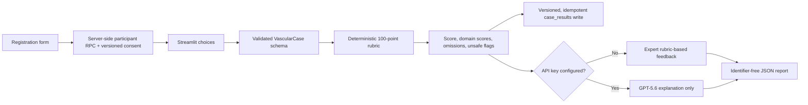

# VascuCase AI

**VascuCase AI** is a deterministic vascular-surgery simulator containing eight expert-authored fictional cases, a persistent participant-registration gate, and result persistence. Each case has a schema-validated deterministic 100-point rubric, critical-action detection, unsafe-choice flags, case-specific feedback, and downloadable reporting. Codex with GPT-5.6 was used to design, implement, test, debug, and harden the application. The public deployment uses privacy-preserving expert rubric-based feedback and requires no OpenAI API key. Optional API-enhanced explanation is supported by the codebase but is not enabled in the public deployment.

> **Education only.** This application is not a medical device, does not provide patient-specific advice, and must not be used for diagnosis or treatment.

## Live application

https://vascucase.streamlit.app/

## Development and validation

- Built and hardened using Codex with GPT-5.6
- 212 automated tests passed
- Python compilation passed
- `pip check` passed
- Streamlit health endpoint returned HTTP 200
- Secret scan found no high-confidence credentials

## Case library

| Case | Category | Difficulty |
|---|---|---|
| AF-related embolic acute lower-limb ischaemia, Rutherford IIb | Arterial emergencies | Intermediate |
| Chronic limb-threatening ischaemia with diabetic toe gangrene and infection | Limb salvage | Advanced |
| Severe symptomatic internal carotid stenosis after TIA | Cerebrovascular disease | Intermediate |
| Ruptured infrarenal abdominal aortic aneurysm | Aortic emergencies | Advanced |
| Thrombosed popliteal artery aneurysm with acute limb ischaemia | Arterial emergencies | Advanced |
| Iliofemoral DVT with phlegmasia cerulea dolens | Venous emergencies | Advanced |
| Penetrating common femoral artery injury with hard signs | Vascular trauma | Advanced |
| Acute embolic mesenteric ischaemia | Visceral vascular emergencies | Advanced |

Before the case library is shown, the learner submits a full name, normalized email address, training level, institution, an institutional number when applicable, and explicit privacy/data-use consent. The registration is persisted through a server-side Supabase client. This flow does not verify email ownership and is not an account login. A matching email may be reused only for internal result linkage when all submitted registration fields match the stored record; no existing private profile fields or prior scores are displayed.

After registration, the landing page supports random selection, category-filtered random selection, or a specific case. Random mode avoids an immediate repeat, tracks completed case IDs in session state, and resets the eligible history after all eligible cases have been completed. Every completed case is stored as a separate, numbered attempt. Case titles are non-diagnostic; the final diagnosis is revealed only after submission.

## Safety-first architecture


```mermaid
flowchart LR
    REG["Registration form"] --> R["Server-side participant RPC + versioned consent"]
    R --> A["Streamlit choices"]
    A --> B["Validated VascularCase schema"]
    B --> C["Deterministic 100-point rubric"]
    C --> D["Score, domain scores, omissions, unsafe flags"]
    D --> P["Versioned, idempotent case_results write"]
    D --> E{"API key configured?"}
    E -- No --> F["Expert rubric-based feedback"]
    E -- Yes --> G["GPT-5.6 explanation only"]
    F --> H["Identifier-free JSON report"]
    G --> H
```

- `vascucase/cases/schema.py` defines the Pydantic models and validates four stages, option references, a 100-point rubric, references, learning points, and synthetic/identifier-free metadata.
- `vascucase/cases/library.py` contains the eight fictional cases, stable option IDs, rubrics, expert pathways, and selection/history logic.
- `vascucase/scoring.py` is the sole scoring authority and applies consistent bands: Excellent (90–100), Good (75–89), Developing (60–74), and Needs improvement (below 60).
- `vascucase/feedback.py` builds offline case-specific feedback. Its isolated Responses API path receives rubric-controlled data only and returns prose only.
- `vascucase/reporting.py` exports case metadata and scoring results without answers, identifiers, or unrestricted free text.
- `vascucase/database.py` validates registration data and uses the server-only Supabase secret for narrow participant and result RPCs.
- `supabase/migrations/20260831000000_create_vascucase_registration.sql` is the version-controlled participant/result schema, indexes, RLS boundary, and transactional registration/result-write implementation.
- `app.py` owns presentation and recoverable Streamlit session state; it contains no clinical rubric.

## Features

- Eight progressive four-stage vascular scenarios
- Learner-level, random, category, and specific-case selection
- Pydantic-validated cases and explicit 100-point rubrics
- Deterministic domain scores, critical omissions, and unsafe-choice flags
- Expert-authored offline feedback for the public application
- Optional GPT-5.6 explanation through the OpenAI Responses API
- Case history, no immediate random repeat, restart, and new-case workflows
- Independently randomized A–D answer positions for every stage of every case, with each correct answer moved on restart
- Diagnosis concealment until submission
- Downloadable JSON performance reports that exclude registration identifiers
- Persistent server-side participant registration without an email-login flow
- Persistent participant profiles with institution fields and versioned, timestamped consent
- Idempotent result IDs and transaction-safe overall and case-version attempt numbering
- Keyboard focus visibility, reduced-motion support, mobile layout rules, and required-answer validation
- Parametrized schema, selection, safety, scoring, reporting, feedback, and Streamlit flow tests

## Run locally

Python 3.11 is the validated runtime.

```bash
python -m venv .venv
```

Activate the environment and install the pinned dependencies:

```bash
# Windows PowerShell
.venv\Scripts\Activate.ps1
pip install -r requirements.txt

# macOS/Linux
source .venv/bin/activate
pip install -r requirements.txt
```

Apply the Supabase migration and add the two server-side Supabase settings described below before registering. The deterministic case engine and expert feedback remain available without an OpenAI API key, but persistent registration and result storage require Supabase.

Launch and test:

```bash
streamlit run app.py
pytest -q
```

## Optional GPT-5.6 configuration

No OpenAI secret is required for deterministic scoring and expert feedback. Participant/result persistence uses the server-side Supabase secret. To enable AI-enhanced explanation, configure the following outside source control:

```bash
OPENAI_API_KEY="your_key"
OPENAI_MODEL="gpt-5.6"
```

The Responses API request uses low reasoning effort, low verbosity, disabled response storage, a random safety identifier that is not the participant ID, and a bounded timeout. API absence, failure, or an empty response uses the expert rubric-based pathway and is never labeled AI-enhanced.

## Supabase setup

The repository is initialized for the Supabase CLI under `supabase/`. The canonical schema is the timestamped migration in `supabase/migrations/`; do not recreate these tables manually in the Dashboard after migration management begins.

1. Install the Supabase CLI and authenticate with `supabase login`. The CLI login uses a Supabase personal access token stored by the CLI, while `supabase link` may prompt for the database password. These operator credentials are separate from the app's `SUPABASE_SECRET_KEY`; never put them in Streamlit secrets or source control.
2. Link this checkout to the intended hosted project, then verify the selected target before any remote command:

```bash
supabase link --project-ref <YOUR_PROJECT_REF>
supabase projects list
```

3. Choose the correct database-history path:
   - **Verified empty project:** review the local migration, back up anything that must be retained, and continue to the dry run below.
   - **Existing schema or migration history:** stop before pushing. Back up the database, run `supabase migration list`, inspect the remote public/private schemas, and baseline or reconcile the database in a separate forward-migration workflow. Do not run `supabase db pull` blindly beside this initial migration, and do not create parallel `vascucase_participants` or `case_results` tables over existing data.

If the CLI is unavailable, use the Supabase SQL Editor read-only before any
deployment:

```sql
select *
from supabase_migrations.schema_migrations
order by version;
```
4. For a verified clean target, preview and apply the migration. `supabase db push` applies DDL directly to the linked remote project:

```bash
supabase db push --dry-run
supabase db push
```

**Current repository status:** this migration has only been authored locally.
The Supabase CLI is unavailable and this checkout has no local CLI link
metadata, so remote migration history could not be verified here. A read-only
relation check reported no existing `users`, `vascucase_participants`, or
`case_results` table, but migration history must still be checked before an
apply. The existing GitHub integration was not changed, and neither
`supabase db push` nor another remote apply command was run.

The migration creates `public.vascucase_participants` and
`public.case_results`, then exposes only narrow service-role RPC wrappers
backed by private `SECURITY DEFINER` helpers with an explicit empty search
path. RLS is enabled with no client-facing policies. Direct table privileges
and general function execution are revoked from `PUBLIC`, `anon`, and
`authenticated`; raw table access is also revoked from `service_role`, then
only the required RPC execution privileges are granted to `service_role`.
This is an object-level restriction, not a project-wide sandbox: the server
secret remains elevated elsewhere in the project and must stay server-side.

5. In **Project Settings → API Keys**, copy the server-only
   `sb_secret_...` key used by the persistence RPC client. Never place this
   value in browser code, reports, logs, screenshots, issues, or source control.
6. Copy `.streamlit/secrets.toml.example` to
   `.streamlit/secrets.toml` locally and replace both placeholders:

```toml
SUPABASE_URL = "https://YOUR_PROJECT_REF.supabase.co"
SUPABASE_SECRET_KEY = "YOUR_SUPABASE_SECRET_KEY"
```

The real `.streamlit/secrets.toml` is ignored by Git. The persistence client
rejects a public client key in the secret-key field, and the app rejects
non-TLS remote project URLs. Store the secret key only in the Streamlit server
secret store. No public client key or email-delivery configuration is required.

For the Supabase GitHub integration, set **Working directory** to `.` because `supabase/` is at the repository root, and make the Supabase migration check a required GitHub status check. If **Deploy to production** is enabled, committed migrations are applied when the configured production branch is pushed or merged. If it is disabled, Git pushes do not deploy the migration; use a reviewed CLI/CI `supabase db push` workflow instead. This implementation does not perform either remote deployment automatically.

## Registration, persistence, and privacy

- `vascucase_participants` stores `participant_id UUID` as its generated
  primary key; required name, lowercase/trimmed email, training level, and
  institution text; nullable `institution_number TEXT`; required
  `consent_given` and `consent_version`; and database timestamps
  `consented_at` and `registered_at`. Institution is trimmed and repeated
  spaces are collapsed. Institutional numbers are trimmed but remain text (so
  leading zeroes, letters, and hyphens survive) and are required only for
  medical students.
- The current consent record version is `vascucase-data-use-v1`. Changing the notice requires a deliberate version change and a re-consent/migration plan; silently rewriting the existing timestamp or version is not acceptable.
- These profile fields and participant-linked case results are **identifiable operational data**. An institutional number is not globally unique and is never used to establish identity.
- Email ownership is not verified. The registration RPC normalizes the submitted
  email and, on a duplicate, reuses the existing participant UUID internally
  only when the normalized name, training level, institution, institutional
  number, and consent metadata match. It never updates the existing row. A
  material mismatch returns a neutral “check your registration information”
  response without confirming that the email exists or exposing stored profile
  data or scores.
- `case_results` stores the stable `result_id UUID` primary key, participant
  UUID foreign key, case ID, `case_version`, case name, integer score and
  maximum score, PostgreSQL-generated percentage, positive overall
  `attempt_number`, positive per-version `version_attempt_number`, and the
  database completion timestamp.
- The downloadable JSON report excludes registration identifiers and unrestricted answers. Any separate research or analytics export must be deliberately de-identified or pseudonymized, access-controlled, and documented. Pseudonymized data remain linkable personal data, and neither process should be described as anonymous without a formal re-identification-risk assessment.
- Registration data and participant UUIDs remain excluded from filenames, URLs, and the optional OpenAI feedback payload. The AI pathway receives learner level plus a separate random safety identifier, not the participant identifier.
- A result write uses a stable result UUID. If a database response is lost after commit, retrying the same semantic completion returns the first stored row instead of creating another attempt; retry identity deliberately ignores a changed `completed_at` value and preserves the first committed database timestamp.
- If a result write fails, the deterministic score/report remains visible and is explicitly marked unsaved; the learner can retry without regenerating the result ID. Restart/new-case controls remain disabled until the result is saved.
- Records remain in PostgreSQL until the database operator applies a retention or deletion policy. Deleting a participant row cascades to that participant's case results. Operators are responsible for an appropriate privacy notice, least-privilege access, retention period, deletion process, export governance, and applicable institutional/legal review.
- Streamlit usage-statistics collection is disabled in the committed app configuration. Never enter real patient information.

## Streamlit Community Cloud

1. Push the repository to GitHub.
2. Create a Community Cloud app with `app.py` as the entry point and Python 3.11.
3. Complete the migration-history review and apply the migration to the intended project. No remote migration was performed by this repository change.
4. Add `SUPABASE_URL` and `SUPABASE_SECRET_KEY` to the app's **Advanced settings → Secrets** field. Never commit them.
5. If AI enhancement is desired, add `OPENAI_API_KEY` and `OPENAI_MODEL` in the same Cloud secrets UI only.
6. In a private browser window, verify new registration with institution fields and consent, exact duplicate-email reuse without profile disclosure, neutral handling of a conflicting duplicate, automatic result storage, overall and per-version attempt numbering, retry behavior, case selection/restart, and JSON download.

Never commit `.streamlit/secrets.toml`, `.env`, API keys, or learner/patient data. These paths are excluded by `.gitignore`.

## Clinical references

Each case renders its own references after completion. The library is grounded in original summaries of the [ESVS acute limb ischaemia guideline](https://esvs.org/wp-content/uploads/2021/08/Acute-Limb-Ischaemia-Feb-2020.pdf), [Global Vascular Guidelines](https://vascular.org/research-quality/guidelines-and-reporting-standards/clinical-practice-guidelines), [IWGDF/IDSA diabetic-foot infection guideline](https://www.idsociety.org/practice-guideline/diabetic-foot-infections/), [ESVS carotid guideline](https://esvs.org/wp-content/uploads/2023/03/ESVS-2023-Carotid-guidelines.pdf), [ESVS aortic aneurysm guideline](https://esvs.org/wp-content/uploads/2024/02/ESVS-2024-AAA-Guidelines.pdf), [SVS popliteal aneurysm guideline summary](https://vascular.org/news-advocacy/articles-press-releases/society-vascular-surgery-releases-clinical-practice-0), [ESVS venous thrombosis guideline](https://www.sciencedirect.com/science/article/pii/S1078588420308686), [ESVS vascular trauma guideline](https://esvs.org/wp-content/uploads/2025/01/2025-Vascular-Trauma-Guidelines.pdf), and [WSES acute mesenteric ischaemia guideline](https://pmc.ncbi.nlm.nih.gov/articles/PMC9580452/).

## Limitations

- The rubrics are expert-authored educational instruments, not validated clinical assessment tools.
- The cases simplify real-world uncertainty and require local expert/curricular review before institutional use.
- Registration does not verify ownership of the submitted email and must not be treated as proof of identity, clinical role, or institutional affiliation.
- A person who knows an existing email and supplies the same registration values can obtain internal linkage to that participant UUID. The application therefore does not expose stored profile details, prior scores, or a learner-history view; stronger identity features would be required before adding those capabilities.
- Live GPT-5.6 quality and availability depend on the user’s optional configuration.

## License

MIT License. Clinical guideline content remains the property of its publishers; this repository contains original fictional cases, summaries, and links rather than reproduced guideline tables.
